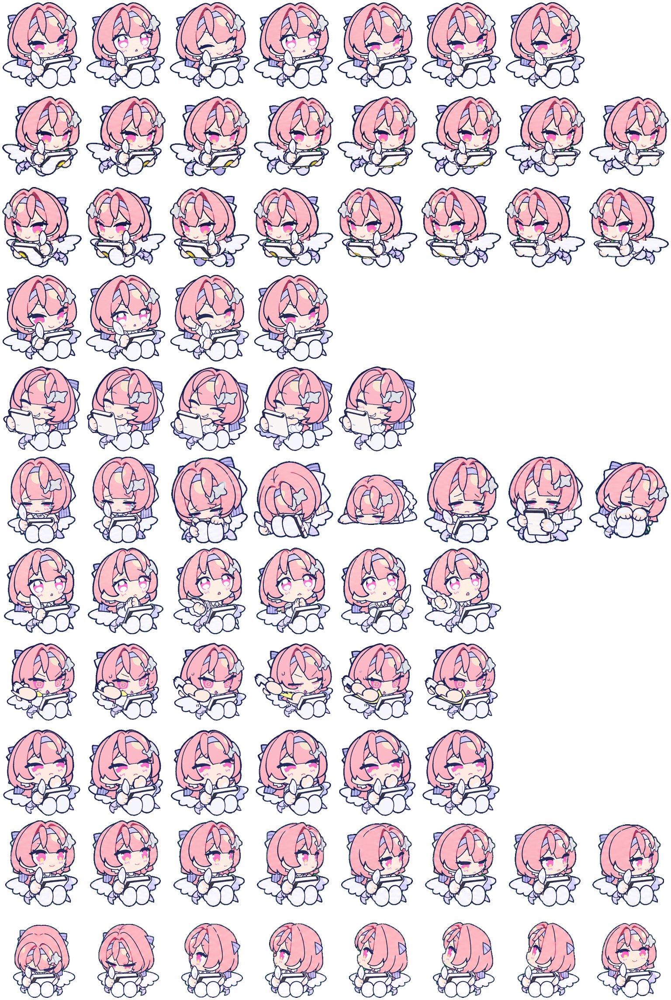

<p align="center">
  
</p>

<p align="center"><b>动态动作预览</b></p>

<table>
  <tr>
    <td width="33%" align="center">
      
      <br><b>向左移动</b><br><sub><code>running-left</code></sub>
    </td>
    <td width="33%" align="center">
      
      <br><b>待机</b><br><sub><code>idle</code> · 呼吸与眨眼</sub>
    </td>
    <td width="33%" align="center">
      
      <br><b>完成庆祝</b><br><sub><code>jumping</code> · <code>smug.gif</code></sub>
    </td>
  </tr>
</table>

<p align="center">
  <a href="#动作图鉴">动作图鉴</a> ·
  <a href="#快速安装">快速安装</a> ·
  <a href="#项目结构">项目结构</a> ·
  <a href="#已知限制">已知限制</a>
</p>

<p align="center">
  <sub>一只粉发白翼、抱着画板和画笔的 Q 版蕾米小天使桌宠。</sub>
</p>

小蕾米是一套可直接安装的 Codex 原生 v2 桌宠资源包：保留原始 GIF 的动作语义，整理成透明精灵图集，并把“工作中、检查中、完成庆祝”等状态映射成更有个性的桌面反馈。

## 动作图鉴

小蕾米的每个动作由米哈游html活动页面的GIF素材整理并AI重绘衍生而来，并输出为 `192 × 208` 的透明 PNG 单帧预览。先看动作，再看安装包：

<table>
  <tr>
    <td width="33%" align="center">
      
      <br><b>待机</b><br><sub><code>idle</code> · 呼吸与眨眼</sub>
    </td>
    <td width="33%" align="center">
      
      <br><b>向右移动</b><br><sub><code>running-right</code></sub>
    </td>
    <td width="33%" align="center">
      
      <br><b>向左移动</b><br><sub><code>running-left</code></sub>
    </td>
  </tr>
  <tr>
    <td align="center">
      
      <br><b>挥手</b><br><sub><code>waving</code> · 互动反馈</sub>
    </td>
    <td align="center">
      
      <br><b>完成庆祝</b><br><sub><code>jumping</code> · 视觉素材为 <code>smug.gif</code></sub>
    </td>
    <td align="center">
      
      <br><b>失败</b><br><sub><code>failed</code></sub>
    </td>
  </tr>
  <tr>
    <td align="center">
      
      <br><b>等待确认</b><br><sub><code>waiting</code></sub>
    </td>
    <td align="center">
      
      <br><b>工作中</b><br><sub><code>running</code> · 视觉素材为 <code>draw_continuous.gif</code></sub>
    </td>
    <td align="center">
      
      <br><b>检查中</b><br><sub><code>review</code> · 视觉素材为 <code>think.gif</code></sub>
    </td>
  </tr>
</table>

<details>
  <summary><b>查看完整动作图集</b></summary>
  <br>
  <p align="center">
    
  </p>
  <p align="center"><sub>每格为 192 × 208；第 0–8 行是标准动作，第 9–10 行是 16 向视线。</sub></p>
</details>

## 快速安装

### Agent 安装（推荐）

如果你使用的 Agent 具备网络访问和本地文件读写权限，可以直接复制下面的提示词，让 Agent 自动完成安装。请先确认你已经允许该 Agent 操作本机文件：

```text
请帮我在这台电脑上安装 GitHub 仓库 https://github.com/HanaAyane/remielle-codex-pet 的 Codex 原生 v2 桌宠“小蕾米”。

请严格执行以下步骤：
1. 识别当前操作系统是 macOS 还是 Windows。
2. 从这个 Release 地址下载并解压安装包：
   https://github.com/HanaAyane/remielle-codex-pet/releases/download/v1.0.0/remielle-codex-pet-v1.0.0.zip
3. 找到解压目录中的 pet.json 和 spritesheet.webp，不要把外层 remielle-codex-pet 文件夹直接当作最终安装目录。
4. 创建 Codex 原生桌宠目录：
   - macOS：~/.codex/pets/xiaolemi/
   - Windows：%USERPROFILE%\.codex\pets\xiaolemi\
5. 只将 pet.json 和 spritesheet.webp 复制到上述 xiaolemi 目录中；不要删除或修改其他桌宠文件。
6. 检查 pet.json 中的 id 是否为 xiaolemi，并确认 spritesheet.webp 存在且可读取。
7. 如果目标目录中已经存在同名文件，先告诉我文件已存在并询问是否覆盖，不要擅自删除其他文件。
8. 最后告诉我实际安装路径、检查结果，以及是否需要重新打开或刷新 Codex 才能看到“小蕾米”。
```

### macOS

#### 从 Release 安装（推荐）

下载 [v1.0.0 安装包](https://github.com/HanaAyane/remielle-codex-pet/releases/download/v1.0.0/remielle-codex-pet-v1.0.0.zip)，然后在终端执行：

```bash
cd ~/Downloads
unzip -o remielle-codex-pet-v1.0.0.zip
mkdir -p ~/.codex/pets/xiaolemi
cp remielle-codex-pet/pet.json ~/.codex/pets/xiaolemi/
cp remielle-codex-pet/spritesheet.webp ~/.codex/pets/xiaolemi/
```

如果 ZIP 不在 `~/Downloads`，请把 `cd` 改为实际下载目录。

#### 从仓库安装

适合需要查看动作映射、版权说明或参与开发的情况：

```bash
git clone https://github.com/HanaAyane/remielle-codex-pet.git
cd remielle-codex-pet
mkdir -p ~/.codex/pets/xiaolemi
cp output/xiaolemi/pet.json ~/.codex/pets/xiaolemi/
cp output/xiaolemi/spritesheet.webp ~/.codex/pets/xiaolemi/
```

检查安装结果：

```bash
ls -lh ~/.codex/pets/xiaolemi/pet.json ~/.codex/pets/xiaolemi/spritesheet.webp
```

#### 手动拖拽安装

1. 解压 `remielle-codex-pet-v1.0.0.zip`。
2. 在 Finder 中按 `⌘ + ⇧ + G`，打开 `~/.codex/pets/xiaolemi/`。
3. 将解压后的 `remielle-codex-pet` 文件夹中的 `pet.json` 和 `spritesheet.webp` 拖入该目录。

如果目标目录不存在，可以先在终端执行 `mkdir -p ~/.codex/pets/xiaolemi`，再用 Finder 打开。最终目录应为：

```text
~/.codex/pets/xiaolemi/
├── pet.json
└── spritesheet.webp
```

不要把外层文件夹直接作为最终目录名；Codex 原生安装目录应使用 `xiaolemi`。

### Windows（PowerShell）

#### 从 Release 安装（推荐）

下载 [v1.0.0 安装包](https://github.com/HanaAyane/remielle-codex-pet/releases/download/v1.0.0/remielle-codex-pet-v1.0.0.zip)，在“下载”文件夹打开 PowerShell，执行：

```powershell
$downloadDir = Join-Path ([Environment]::GetFolderPath("UserProfile")) "Downloads"
Set-Location $downloadDir
Expand-Archive -Path .\remielle-codex-pet-v1.0.0.zip -DestinationPath . -Force

$petDir = Join-Path ([Environment]::GetFolderPath("UserProfile")) ".codex\pets\xiaolemi"
New-Item -ItemType Directory -Force -Path $petDir | Out-Null
Copy-Item .\remielle-codex-pet\pet.json -Destination $petDir -Force
Copy-Item .\remielle-codex-pet\spritesheet.webp -Destination $petDir -Force
```

如果 ZIP 不在“下载”文件夹，请修改 `$downloadDir` 的路径。

#### 从仓库安装

适合需要查看动作映射、版权说明或参与开发的情况：

```powershell
$downloadDir = Join-Path ([Environment]::GetFolderPath("UserProfile")) "Downloads"
Set-Location $downloadDir
git clone https://github.com/HanaAyane/remielle-codex-pet.git
Set-Location .\remielle-codex-pet

$petDir = Join-Path ([Environment]::GetFolderPath("UserProfile")) ".codex\pets\xiaolemi"
New-Item -ItemType Directory -Force -Path $petDir | Out-Null
Copy-Item .\output\xiaolemi\pet.json -Destination $petDir -Force
Copy-Item .\output\xiaolemi\spritesheet.webp -Destination $petDir -Force
```

检查安装结果：

```powershell
$petDir = Join-Path ([Environment]::GetFolderPath("UserProfile")) ".codex\pets\xiaolemi"
Get-Item "$petDir\pet.json", "$petDir\spritesheet.webp"
```

#### 手动拖拽安装

1. 解压 `remielle-codex-pet-v1.0.0.zip`。
2. 在资源管理器地址栏输入 `%USERPROFILE%\.codex\pets\xiaolemi\` 并回车。
3. 将解压后的 `remielle-codex-pet` 文件夹中的 `pet.json` 和 `spritesheet.webp` 拖入该目录。

如果目标目录不存在，请先创建以下文件夹：

```text
C:\Users\你的用户名\.codex\pets\xiaolemi\
├── pet.json
└── spritesheet.webp
```

`.codex` 是隐藏目录，但可以直接在资源管理器地址栏输入路径访问。不要把外层文件夹直接作为最终目录名；Codex 原生安装目录应使用 `xiaolemi`。

### 完成安装

重新打开 Codex，或刷新桌宠列表，然后选择 **小蕾米**。

原生 Codex v2 安装只需要两个文件：

```text
pet.json          # 名称、描述、v2 版本和精灵图路径
spritesheet.webp  # 1536 × 2288，透明 RGBA，8 × 11 图集
```

`animation-triggers.json`、`ANIMATION-TRIGGERS.md` 和 `NOTICE.md` 是动作映射、使用说明与版权声明文件，不属于 Codex v2 的硬性安装字段，但建议在源码目录中一并保留。

## 动作语义与触发

| 原生状态 | 小蕾米语义 | 当前素材 / 典型使用 |
| --- | --- | --- |
| `idle` | 待机 | `idle.gif` |
| `running-right` | 向右移动 | 移动反馈 |
| `running-left` | 向左移动 | 移动反馈 |
| `waving` | 挥手 | 启动、鼠标移入、点击互动 |
| `jumping` | 完成庆祝 | `smug.gif`；任务完成或互动成功 |
| `failed` | 失败 | 任务失败 |
| `waiting` | 等待确认 | 需要用户输入或审批 |
| `running` | 工作中 | `draw_continuous.gif` |
| `review` | 检查中 | `think.gif` |

## 16 向视线

v2 图集额外包含 16 个按顺时针排列的视线方向：

```text
000  022.5  045  067.5  090  112.5  135  157.5
180  202.5  225  247.5  270  292.5  315  337.5
```

这些方向素材已经打包进 `spritesheet.webp`，可供支持视线方向的运行器使用。当前仓库本身是桌宠素材包，不包含鼠标监听、任务状态监听或通知监听程序；`animation-triggers.json` 是声明式映射，不会单独生成事件监听能力。

## 项目结构

```text
小蕾米桌宠/
├── ASSET-USAGE.md         # 非商业署名使用说明
├── NOTICE.md              # 第三方来源与版权边界
├── output/xiaolemi/        # 推荐发布与安装的原生桌宠包
├── gif/                    # 原始动作 GIF 素材
├── 表情包单张预览/          # 9 个动作的透明 PNG 单帧预览
├── assets/readme/          # README 的宣传图与可编辑排版源文件
└── .gitignore              # 排除本地生成工作区与系统文件
```


## 已知限制

- `jumping` 是 Codex 原生状态名；小蕾米实际显示为 `smug` 完成庆祝动作。
- `running` 在小蕾米这里表达“工作中”，不是奔跑；实际使用 `draw_continuous.gif`。
- 16 向视线是否实际跟随鼠标，取决于当前 Codex 运行器是否启用该能力。
- 公开发布原始 GIF 前，请确认你拥有相应的公开和再分发权利。

## 版权与声明

本项目是非官方、非商业的个人同人衍生项目，与米哈游、HoYoverse、《绝区零》及相关官方活动不存在隶属、合作、赞助或背书关系。

部分角色视觉、动作参考及原始素材来源于米哈游官方活动。原始素材及相关知识产权归米哈游及其他相关权利人所有；本项目不主张拥有这些原始素材的版权，也未获得其商业授权。部分动作经过人工整理、编辑和 Codex AI 辅助生成，属于基于官方素材的衍生内容。

本项目仅用于个人学习、非商业展示与技术研究。不得将含有上述衍生素材的桌宠包、GIF、精灵图或宣传图出售、商业授权，或用于暗示官方关联的用途。

完整来源和权利边界见 [NOTICE.md](./NOTICE.md)。对于本项目作者有权许可的部分，非商业署名使用说明见 [ASSET-USAGE.md](./ASSET-USAGE.md)；该说明不构成对米哈游官方素材的通用再授权。
